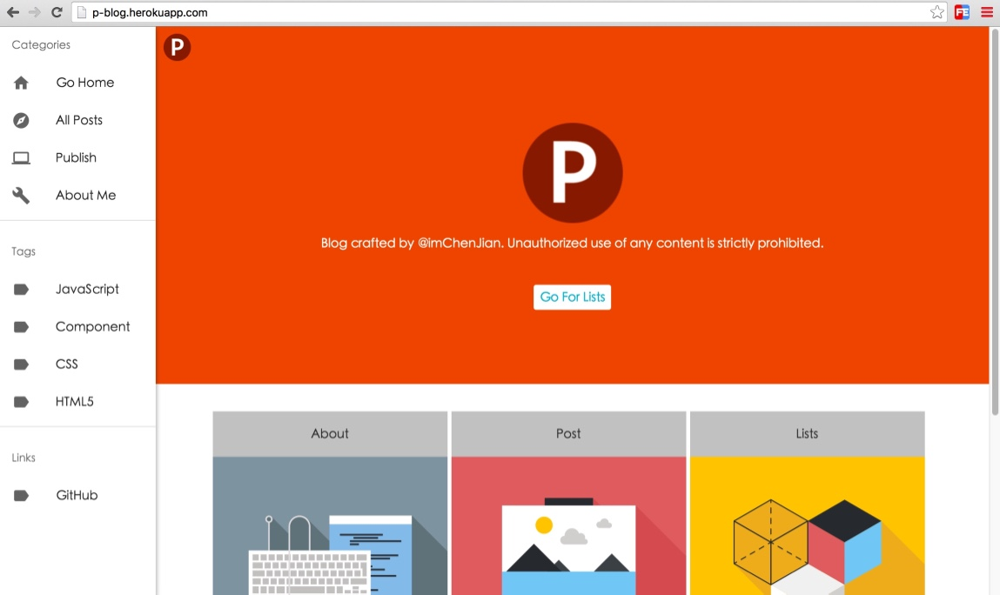

# About

经历了一周多的时间，终于这个工程就要要完成了，终于感受到了windows带来的麻烦事，windows上mangodb的环境搭建太费事了，哎！伤心事不提了，server端的日志系统也在慢慢构建。工程完成80%.

## 技术选型

* 追求前后端全部组件化的组织

服务端是Node.js; 
前端框架是React+jquery; 
CSS用的scss+webpack编译; 
前端UI用的是Material-ui;(leftnav) 
前端路由用的是director,后端路由自己写的; 
应用框架选了Express(4.x变化挺大不少中间件都废了); 
数据服务用的是Mongoose(基于node-mongodb开发的MongoDB nodejs驱动); 
模板引擎选用的是Express React Views(没选主流的Jade或ejs, 它实现了在服务端渲染React组件); 
打包工具用的是webpack+一些列的loader(md用的raw-loader); 
全站采用响应式布局，M和PC共用

## Howto

* git clone this project
* cd into the folder
* run npm i (may require sudo)
* run node app.js & the program would run @localhost:3001

## 目录介绍

* logsFile: server logs files
* models: mongoose models
* pages: website home
* public: static resource
* routes: server route entry
* schemas: mongoose schemas
* src: markdown to jsx
* view: client components & server templetes
* app.js: server entry

## 展示

PCindex:

## Contact Me
QQ: 792041894 
weibo: [@imChenJian](http://weibo.com/2973985050) 
zhihu: [@imChenJian](https://www.zhihu.com/people/imchenjian) 
weixin: chenjian3875 
Email: chenjiancj2011@outlook.com 

